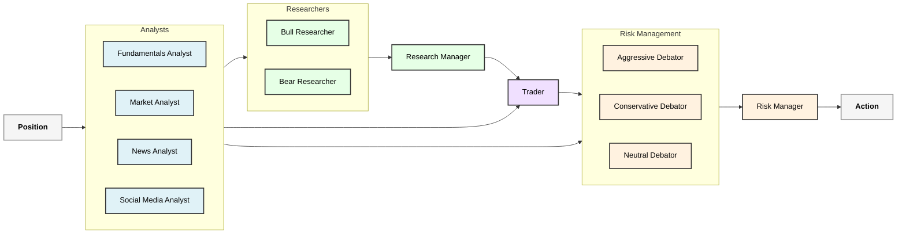

# trading-agents

trading-agents is a multi-agent financial trading framework re-implemented in Go, based on the original [TradingAgents](https://github.com/TauricResearch/TradingAgents/).

## Data Flow

The system operates through a sequential flow of specialized agents, each contributing to the final trading decision.



## Getting Started

### Prerequisites

*   **Go:** Ensure you have Go (version 1.23.2 or later) installed.
*   **Environment Variables:** Set up the necessary API keys and configuration in your environment.

### Configuration

The application is configured using environment variables, typically managed via an `.envrc` file (which is ignored by Git for security). An example `.envrc` is provided:

```bash
export PORT=3001
export LOG_FORMAT="text"

export LLM_PROVIDER="gemini" # or "ollama"
export LLM_MODEL="gemini-2.5-flash" # or "gemma3:4b" etc...

# Ollama specific
export LLM_API_URL="http://localhost:11434"

# Gemini specific (using Vertex AI backend)
export GOOGLE_CLOUD_PROJECT="your-gcp-project-id"
export GOOGLE_CLOUD_LOCATION="your-gcp-region"

export FINNHUB_API_KEY="YOUR_FINNHUB_API_KEY"
export SIMFIN_API_KEY="YOUR_SIMFIN_API_KEY"

export API_TIMEOUT="10s"
export API_CACHE_TTL="8760h"
```

## Contributing

Contributions are welcome! Please open an issue or submit a pull request with your changes. Ensure you follow the project's coding standards.